# Activity Process Guides Visual Supplement

## Purpose

This Visual Supplement provides selected screenshots for workflows where visual recognition materially improves understanding.

The canonical **Activity Process Guides** remain the process source of truth. This supplement is explanatory: it helps users recognise the relevant screens, actions, state changes, and workflow boundaries without turning the canonical guide into a click-by-click screenshot manual.

Use this supplement together with:

- `activity-process-guides.md`
- the relevant Welcome Guide for the user's role
- the approved Telectro workspace and Partner-safe or Customer-safe views

## How to use this supplement

The screenshots use controlled `[PILOT TEST][DOC-NN]` records captured in Production so that the examples match the real pilot UI while remaining clearly separate from live Customer and Partner work.

Focus on the action or state called out in each caption. Some surrounding fields are standard Frappe or Helpdesk context and are intentionally left visible when they help orient the user.


# 1. Customer requests, Customer-visible updates, and evidence

This chapter supports the Customer-facing request and communication processes. The important boundary is that internal ticket work, attached evidence, and Customer-visible communication are separate concepts.

## 1.1 Customer logs a support request

A Customer can provide the affected service area, severity, location context, subject, and explanation from the Customer portal. Where a Boschendal location is known, the selected Fault Point makes the affected place explicit.

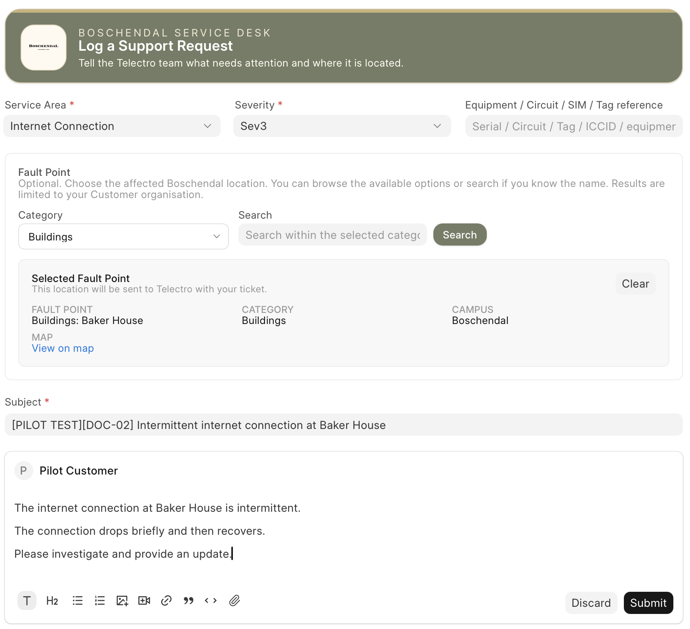

*The Customer request form with Boschendal location context and the selected `Buildings: Baker House` Fault Point.*

## 1.2 Attach ticket evidence before making it Customer-visible

Uploading a file to the ticket stores evidence against the HD Ticket. It does not by itself make the file visible to the Customer.

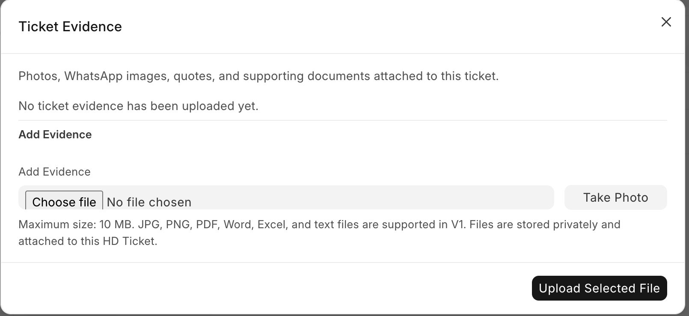

*Use Ticket Evidence to attach the supporting file to the current ticket first.*

## 1.3 Choose the Customer-facing action

The Customer action menu separates a normal Customer-visible progress update from resolving the Customer ticket.

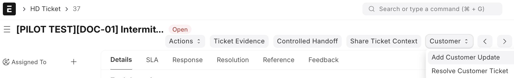

*Use `Add Customer Update` for progress or follow-up communication; use `Resolve Customer Ticket` when the ticket is ready to move to the resolved state.*

## 1.4 Write the Customer-visible update

The update field is explicitly Customer-visible. Do not put internal troubleshooting or coordination notes here. An already-attached file can be selected when supporting evidence needs to accompany the message.

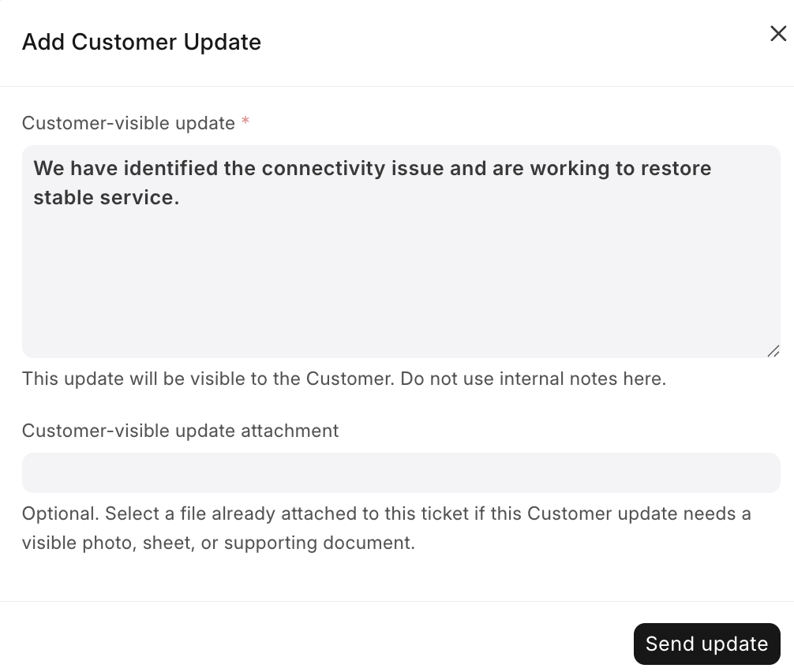

*The dialog reminds the user that this text will be visible to the Customer and that the attachment is selected separately.*

## 1.5 Confirm the Customer can see the follow-up

After the update is sent, the Customer portal shows the latest update prominently and also preserves it in the ticket Activity history.

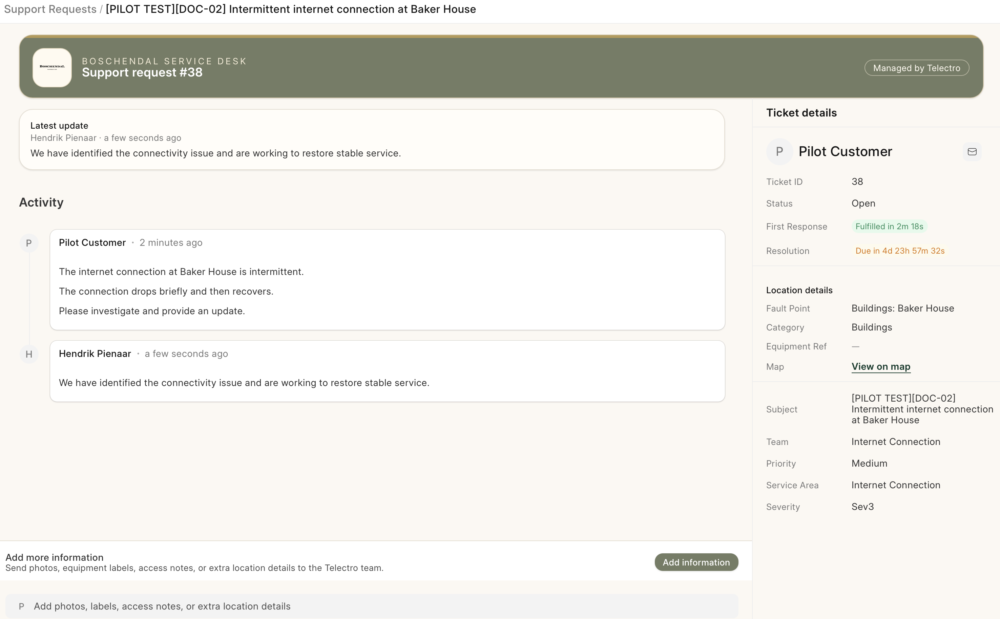

*The Customer sees the Telectro update on the correct support request together with the ticket's current context.*

## 1.6 Select completion evidence when resolving

Completion evidence follows the same attachment-first rule: select from evidence already attached to the ticket rather than uploading a new file from the resolution dialog.

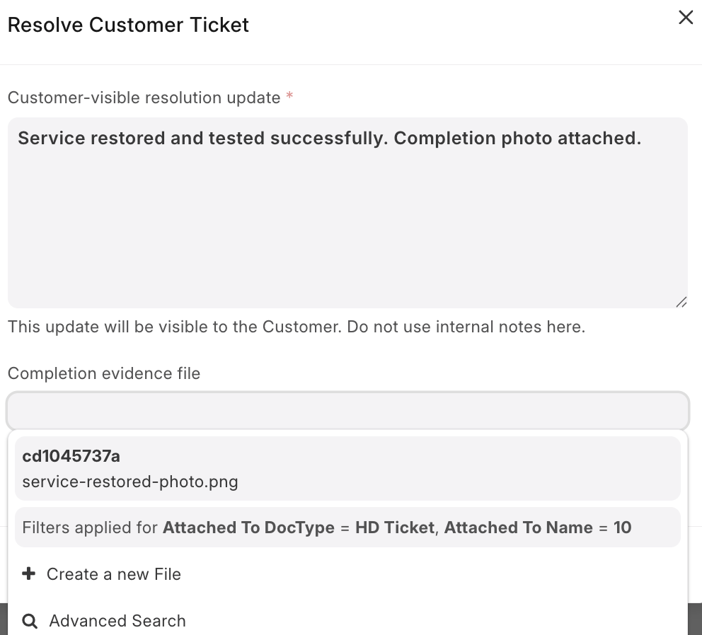

*The open selector shows the attached File record together with the human-readable filename, making the intended completion evidence clear.*


# 2. Ticket ownership and internal collaboration

Assignment represents accountable ownership. A true pool ticket is unassigned. Claim, Release, Controlled Handoff, and Share Ticket Context solve different operational problems and should not be treated as interchangeable actions.

## 2.1 Claim an unassigned ticket

A genuine pool ticket can be claimed by an eligible user through the ticket Actions menu.

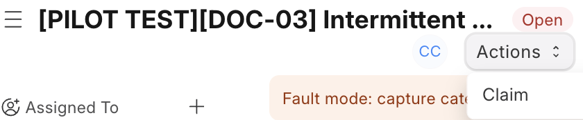

*`Actions → Claim` is available while the ticket is unassigned.*

The resulting Activity entry records the new accountable owner.

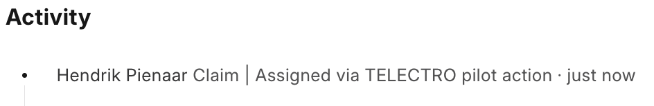

*The claim is recorded as an accountable ownership change.*

## 2.2 Release a ticket back to the pool

Release is used when the current owner should return the ticket to the unassigned pool.

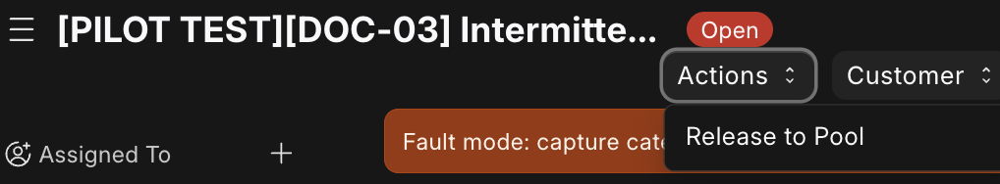

*The current owner chooses `Actions → Release to Pool`.*

A reason is required so the release has useful operational context.

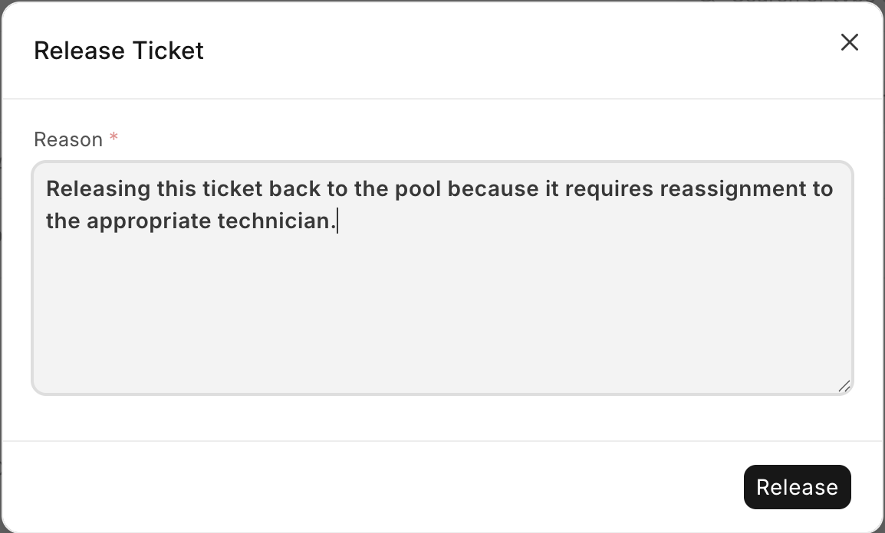

*Record why the ticket is being returned to the pool before releasing it.*

The unassigned result is most clearly visible in the Unclaimed War Room.

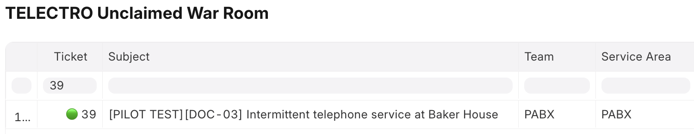

*The ticket remains in the PABX team/service area but appears in the Unclaimed War Room because it has no accountable owner.*

## 2.3 Use Controlled Handoff when accountability must move to a known owner

Controlled Handoff is a deliberate ownership transfer. It identifies the current accountable owner, the new accountable owner, and the reason for the change.

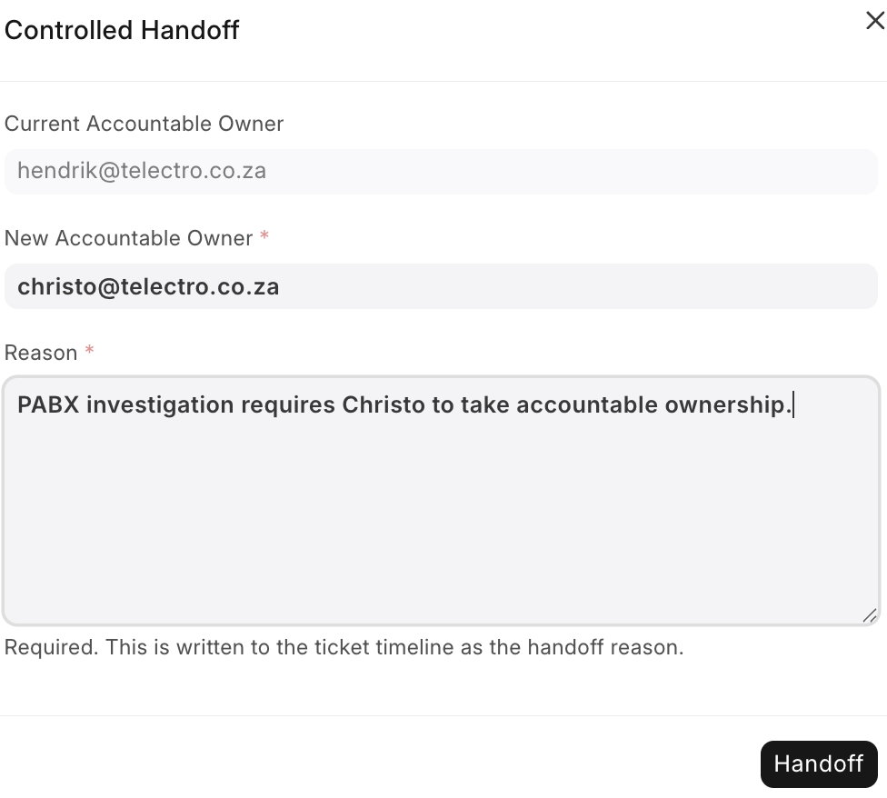

*The handoff makes both the ownership change and the reason explicit before it is applied.*

The receiving user is notified of the handoff.

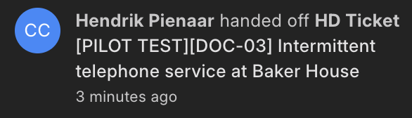

*The recipient-side notification confirms that the ticket was handed off and identifies the ticket involved.*

## 2.4 Share ticket context without changing accountable ownership

Share Ticket Context supports collaboration while leaving the accountable owner unchanged. This is especially useful for Coordinator/Supervisor oversight and additional operational support.

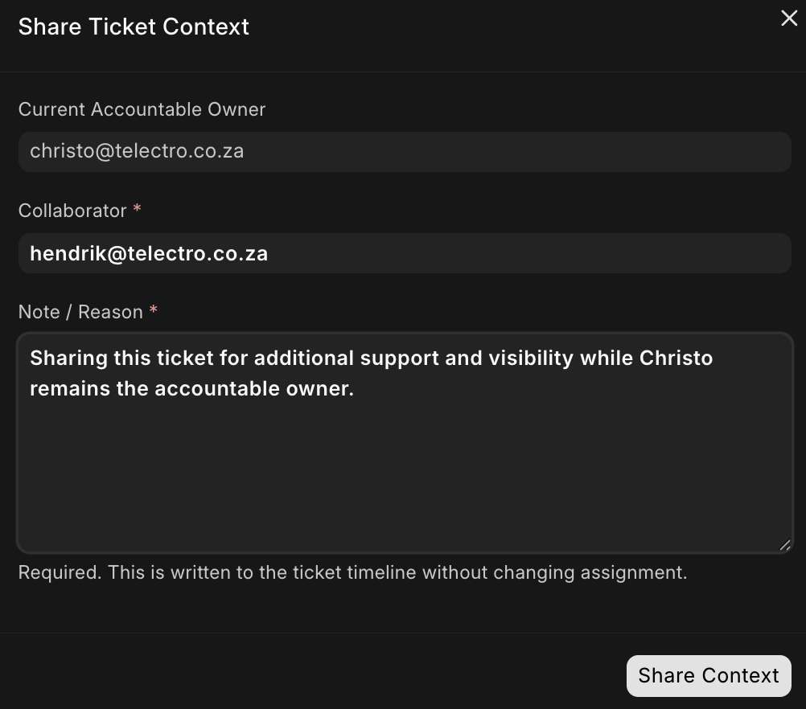

*The dialog explicitly states that the context is written to the ticket timeline without changing assignment.*

The resulting Activity record preserves who shared the context, who received it, the reason, and the relevant ticket context.

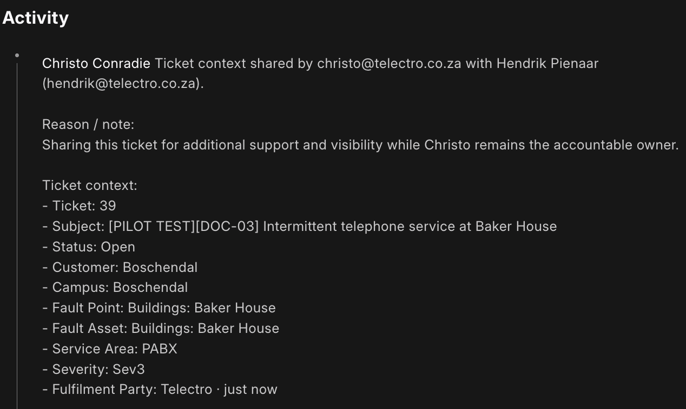

*Sharing expands visibility and collaboration; it does not perform an ownership handoff.*


# 3. Partner-originated requests and Partner Acceptance

Partner Acceptance is used when a Partner asks Telectro to perform work and Telectro later asks that Partner to review the outcome. It is not the same as Partner Work Completion.

The workflow is:

```text
Partner logs request
→ Telectro performs the work
→ Telectro requests Partner acceptance
→ Partner accepts or requests rework
→ Telectro reviews the Partner response
```

## 3.1 Partner logs a service request

Partner-originated requests are created from the Partner-safe Partner Request page under the Partner organisation the logged-in user is authorised to represent.

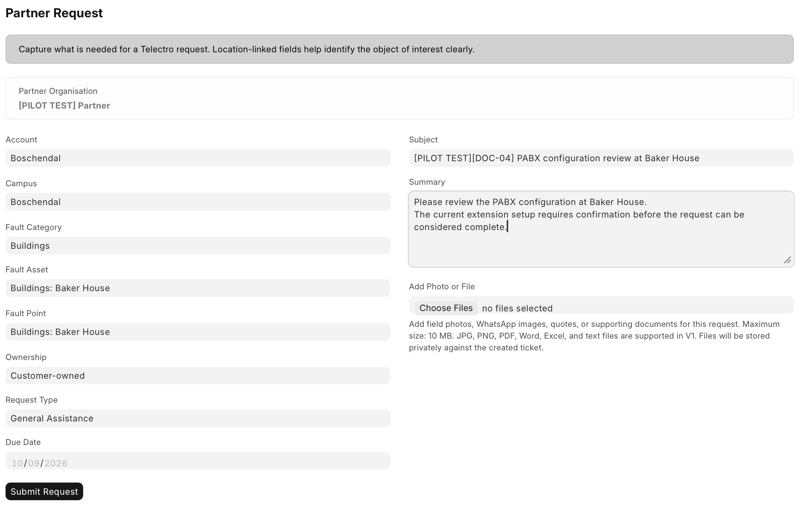

*The request carries Partner organisation, Account, location, request type, subject, summary, and optional evidence context.*

After submission, the request appears in the Partner's submitted-ticket list.

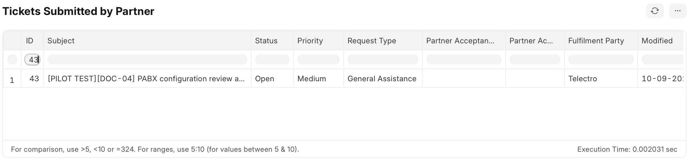

*The newly created Partner-originated ticket is visible with its Open status, request type, and Telectro fulfilment responsibility.*

## 3.2 Telectro requests Partner Acceptance

When Telectro believes the Partner-originated request has been handled sufficiently, Telectro requests Partner Acceptance and can include a note explaining what should be reviewed.

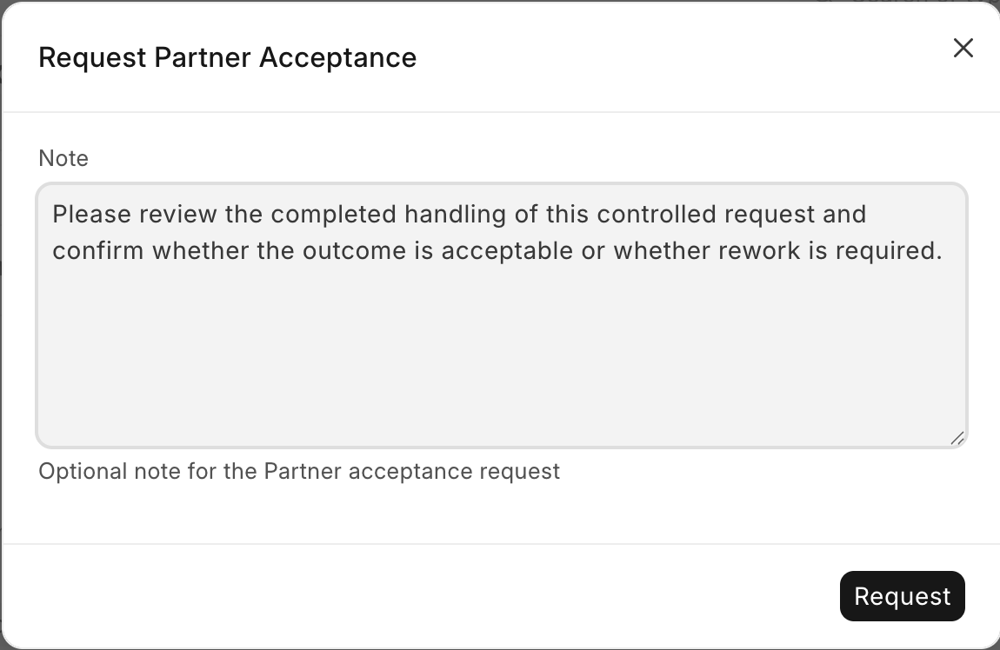

*The acceptance request note provides Partner-facing review context.*

## 3.3 Partner reviews the pending acceptance request

On the Partner-safe ticket page, the Partner can either submit an acceptance note or request rework.

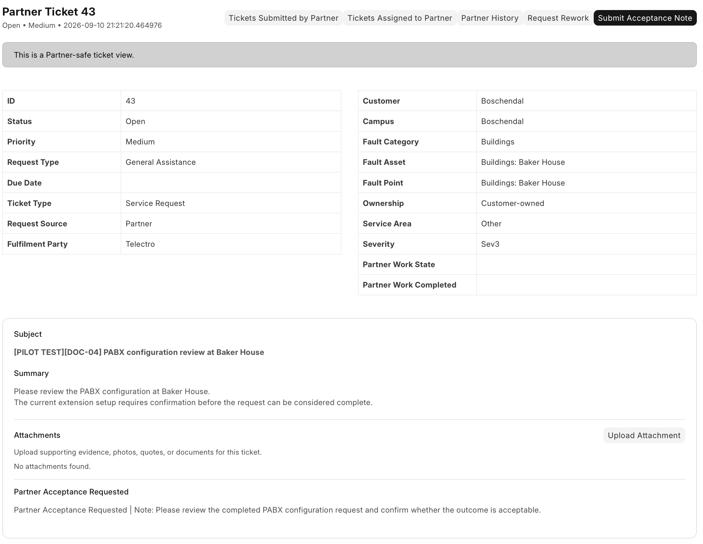

*The Partner-safe view shows the request context, the Partner Acceptance Requested note, and the two Partner response actions.*

## 3.4 Partner requests rework when the outcome still needs correction

Request Rework is used when Telectro must correct, clarify, or complete something before the Partner can accept the outcome.

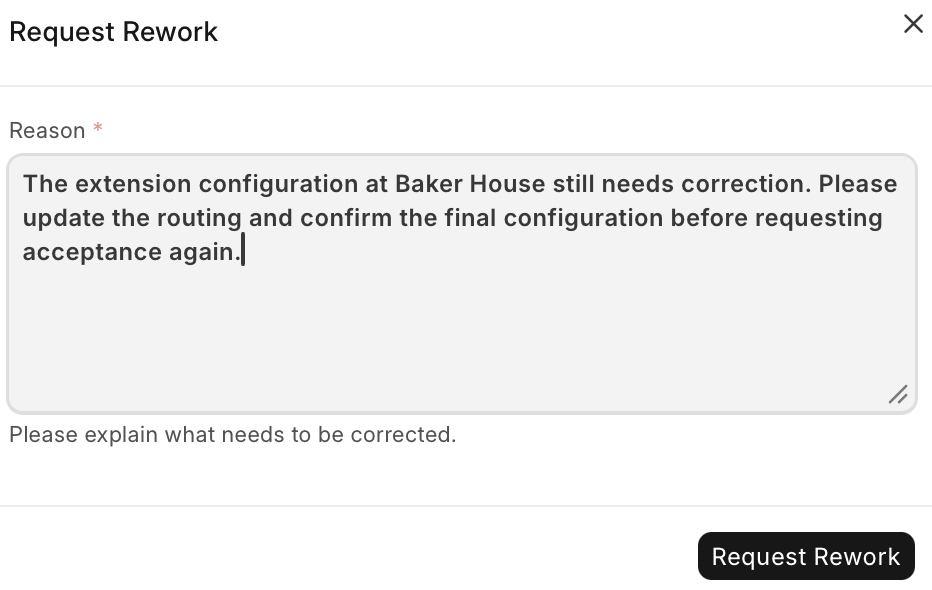

*The Partner gives a specific reason describing what still needs to be corrected.*

The Partner-safe ticket preserves both the rework reason and the earlier acceptance request.

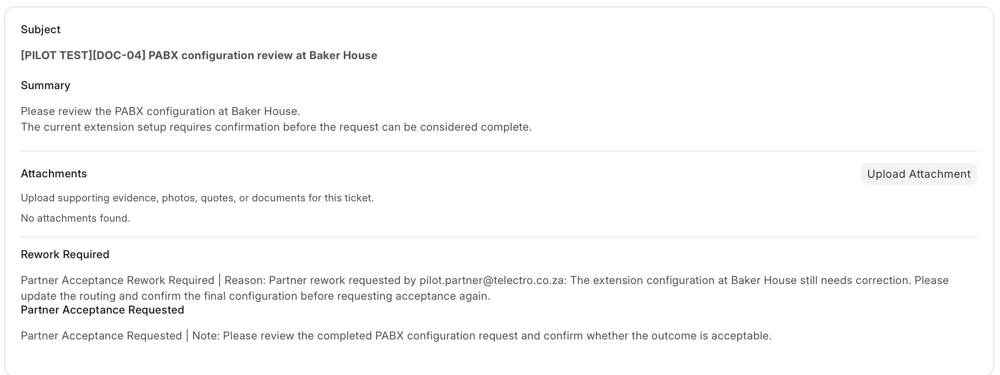

*The ticket now shows `Rework Required` together with the reason and prior acceptance-request context.*

Telectro receives the item in the Partner Acceptance Rework Queue.

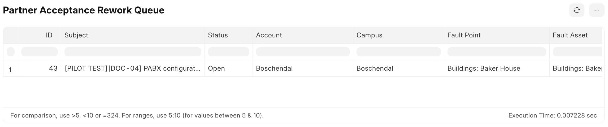

*The queue gives Coordinator/Supervisor users a clear Telectro-side entry point for Partner Acceptance rework.*

## 3.5 Telectro requests acceptance again after correction

After addressing the Partner's rework request, Telectro can ask the Partner to review the corrected outcome again.

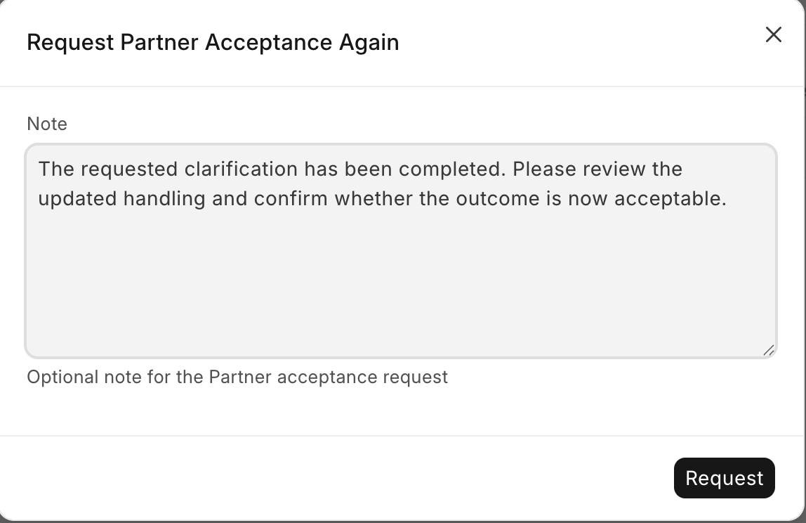

*The second request should explain what was corrected and what the Partner should review.*

The Partner-safe ticket then shows the rework history followed by the renewed Partner Acceptance Requested note.

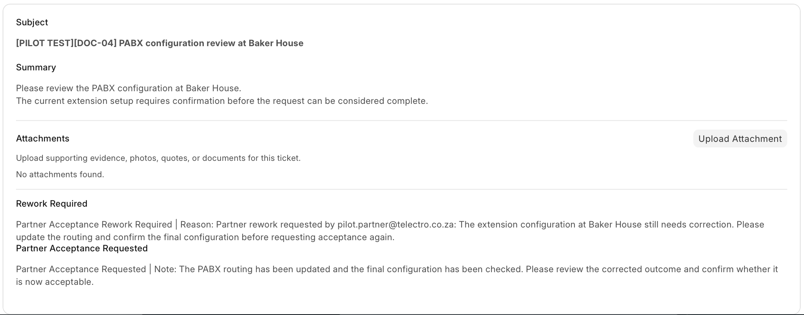

*The visible sequence shows why the request returned to the Partner and what Telectro changed before asking for acceptance again.*


# 4. Telectro-assigned Partner Work Completion and rework

Partner Work Completion is the opposite Partner workflow. Here Telectro assigns fulfilment work to a Partner. The Partner submits Work Done, but Telectro must still review the completed work before it is accepted.

The workflow is:

```text
Telectro assigns Partner fulfilment
→ Partner performs the work
→ Partner submits Work Done
→ Telectro reviews the submission
→ Telectro accepts or requests rework
→ Partner resubmits when rework is required
→ Telectro performs the final review
```

## 4.1 Telectro requests rework on a Partner Work submission

When the Partner's Work Done submission is incomplete or lacks required verification, Telectro can select `Request Rework` in Review Partner Work and give a specific reason.

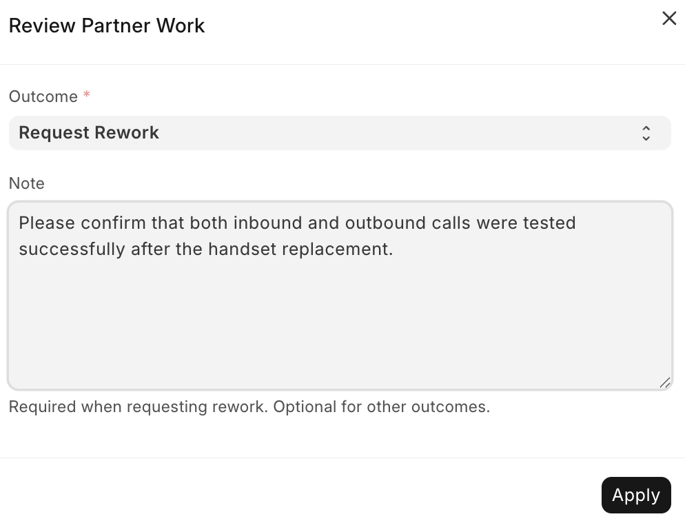

*The review identifies the missing inbound/outbound call verification and requests rework rather than accepting the submission.*

## 4.2 Partner sees the rework requirement

The Partner-safe view changes the Partner Work State to `Rework Required`, preserves the prior Work Done note, and shows Telectro's rework reason.

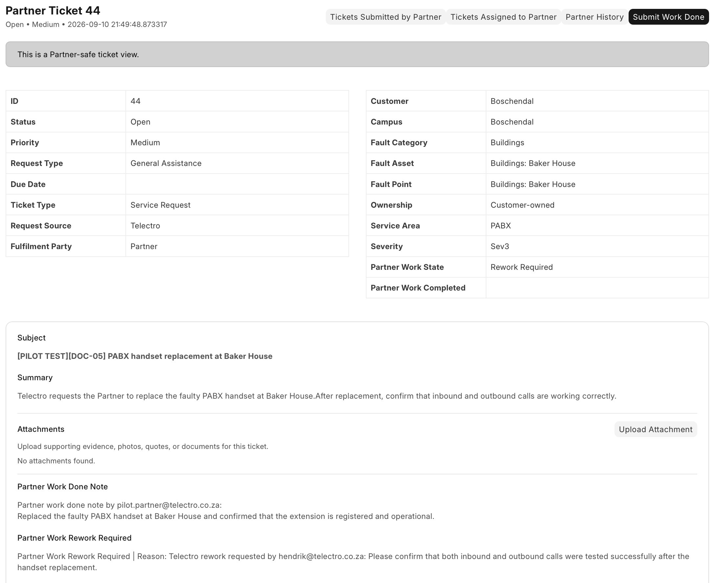

*The Partner can see exactly what must be corrected before submitting Work Done again.*

## 4.3 Partner resubmits corrected work

After completing the requested verification, the Partner submits a new Work Done note. The Partner Work State returns to `Work Completed by Partner` and the completion date is recorded.

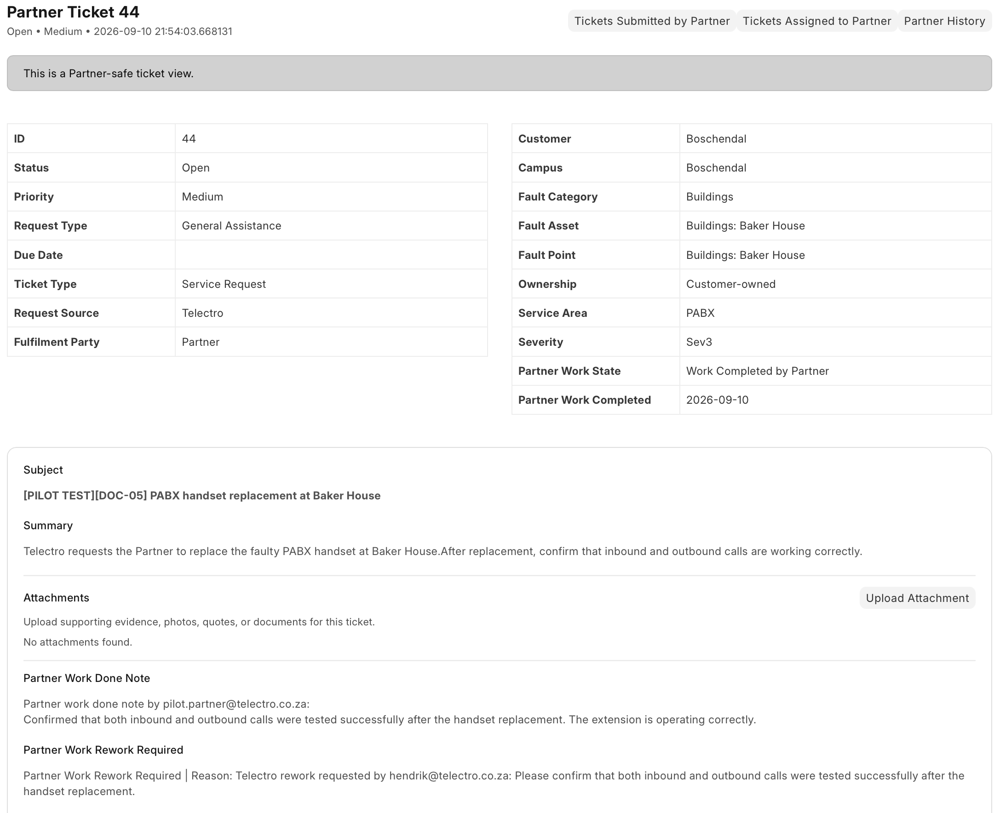

*The corrected submission addresses the rework reason while keeping the earlier rework history visible.*

## 4.4 Telectro reviews the corrected Partner work

After Telectro accepts the corrected submission, the Partner Work State becomes `Reviewed by Telectro`.

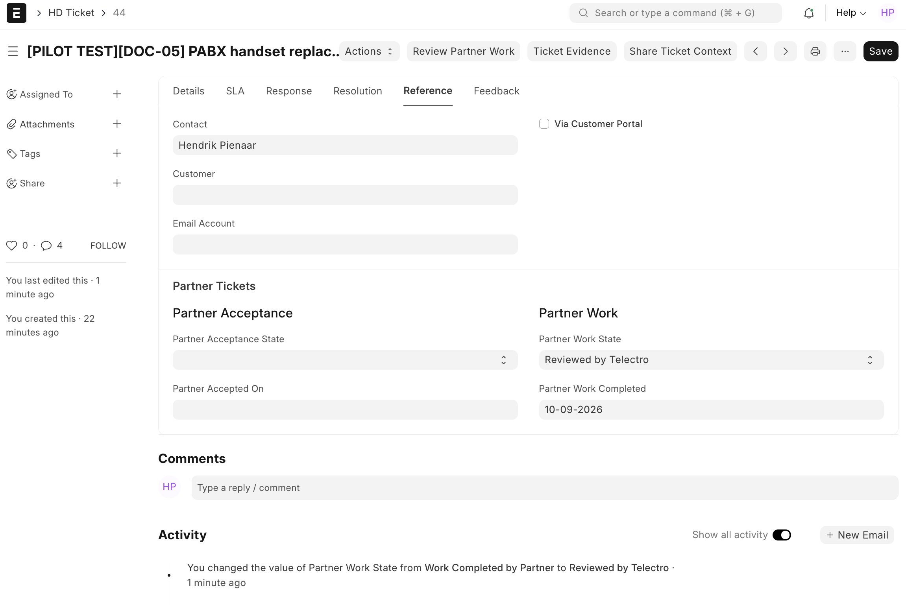

*The final state and Activity transition show that Partner completion and Telectro review are separate steps.*


# 5. Publication and maintenance notes

The visual supplement is intentionally selective. Do not add screenshots merely because an image is available.

Maintain these rules when updating it:

- keep the canonical Activity Process Guides text-first;
- use screenshots for non-obvious workflows, meaningful state changes, unfamiliar UI concepts, and evidence/attachment behaviour;
- prefer controlled `[PILOT TEST][DOC-NN]` examples over engineering proof records;
- keep enough ticket/page context to orient the reader;
- avoid browser chrome, debug evidence, engineering proof wording, and incidental personal email addresses where they are not required by the workflow;
- accept standard Frappe truncation or fixed layout when it does not prevent understanding;
- do not cosmetically edit or composite screenshots to make the product appear different from the real UI;
- when the underlying workflow materially changes, update the canonical Activity Process Guide first and then refresh the corresponding visual explanation.

## Asset-library note

`visual-22-partner-work-request-rework-dialog.png` is retained in the controlled asset library as an earlier approved example of the same `Review Partner Work → Request Rework` interaction. It is not repeated in this Master Supplement because `visual-23-telectro-partner-work-rework-required.png` covers the same interaction using the current DOC-05 scenario and avoids duplicate visual guidance.
